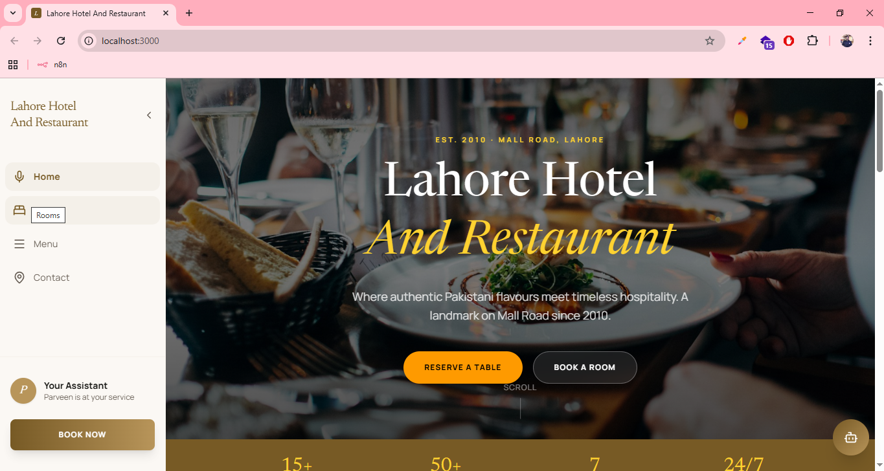
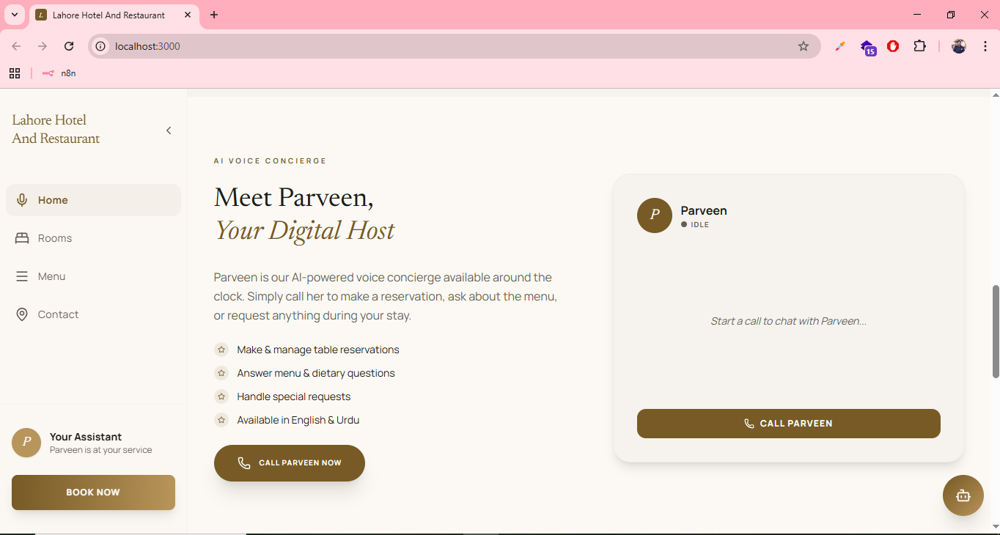
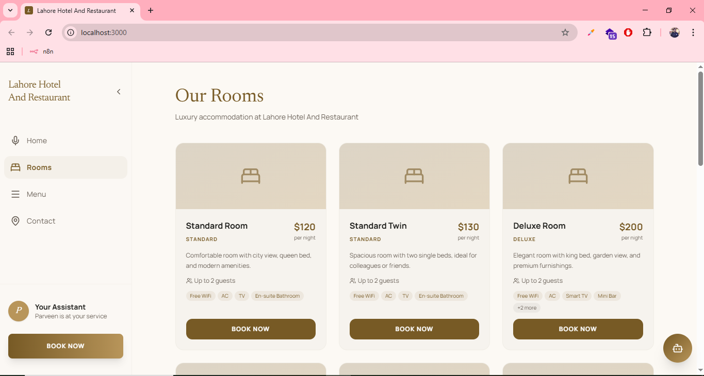
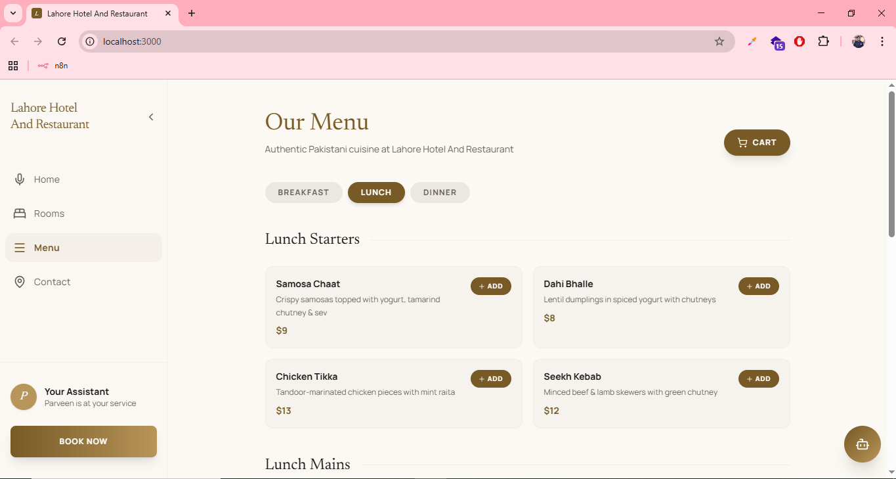
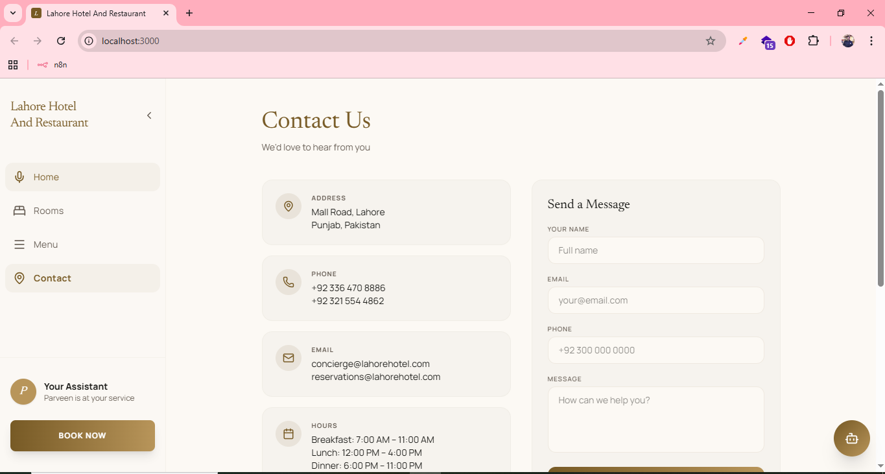
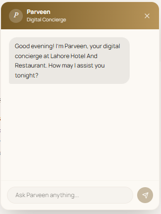

# Lahore Hotel and Restaurant

A full-stack AI-powered hotel and restaurant concierge. Guests can make, look up, and cancel table reservations by talking to **Parveen** - a LiveKit voice agent powered by Gemini via Ollama Cloud, Deepgram STT, and Edge TTS. The frontend also supports text chat, hotel room bookings, and a full restaurant menu with cart. Every room booking fires an n8n webhook that sends a Telegram notification to staff.

---

## Workflow


---

## Screenshots

<table>
  <tr>
    <td></td>
    <td></td>
  </tr>
  <tr>
    <td></td>
    <td></td>
  </tr>
  <tr>
    <td></td>
    <td></td>
  </tr>
</table>

---

## Project Structure

```
hotel/
├── backend/
│   ├── voice_agent_module.py   # LiveKit voice agent + reservation tools + PDF receipts
│   ├── start.py                # Starts all services in one command
│   ├── token_server.py         # LiveKit token endpoint        (port 8080)
│   ├── chat_server.py          # Text chat endpoint            (port 8081)
│   ├── reservations_server.py  # Reservations REST API         (port 8082)
│   ├── rooms_server.py         # Room bookings REST API + n8n  (port 8083)
│   ├── edge_tts_plugin.py      # Edge TTS plugin for LiveKit
│   ├── pyproject.toml
│   └── reservations/           # Auto-generated PDF receipts (gitignored)
└── frontend/
    ├── src/
    │   ├── App.tsx
    │   ├── types.ts
    │   ├── lib/
    │   │   ├── useSofia.ts     # Voice agent (LiveKit) hook
    │   │   ├── useChat.ts      # Text chat hook
    │   │   └── useCart.ts      # Cart hook
    │   └── data/
    │       ├── menu.ts         # Restaurant menu data
    │       └── rooms.ts        # Hotel rooms data
    ├── index.html
    └── package.json
```

---

## Prerequisites

- Python 3.11+
- Node.js 18+
- [uv](https://docs.astral.sh/uv/) - Python package manager
- [Ollama](https://ollama.com) v0.12+ signed in to Ollama Cloud
- A [LiveKit Cloud](https://livekit.io) project
- A [Deepgram](https://deepgram.com) API key
- An [n8n](https://n8n.io) instance (cloud or self-hosted)
- A Telegram bot token + chat ID (for booking notifications)

---

## Backend Setup

**1. Install dependencies**

```bash
cd backend
uv sync
```

**2. Configure environment variables**

```bash
cp .env.example .env
```

Fill in `backend/.env`:

```env
# LiveKit
LIVEKIT_URL=wss://your-project.livekit.cloud
LIVEKIT_API_KEY=your_livekit_api_key
LIVEKIT_API_SECRET=your_livekit_api_secret
LIVEKIT_ROOM=restaurant-lobby

# Deepgram (STT)
DEEPGRAM_API_KEY=your_deepgram_api_key

# Google (optional, for direct Gemini access)
GOOGLE_API_KEY=your_google_api_key

# Ollama Cloud
OLLAMA_MODEL=gemini-3-flash-preview:cloud
OLLAMA_BASE_URL=http://localhost:11434/v1

# n8n webhook (room bookings -> Telegram)
N8N_WEBHOOK_URL=https://your-n8n-instance.com/webhook/hotel-room-booking

# Server ports
TOKEN_SERVER_PORT=8080
CHAT_SERVER_PORT=8081
RESERVATIONS_SERVER_PORT=8082
ROOMS_SERVER_PORT=8083
```

**3. Pull the Ollama cloud model**

```bash
ollama signin
ollama pull gemini-3-flash-preview:cloud
```

**4. Start all services**

```bash
python start.py dev
```

| Service             | Port |
|---------------------|------|
| Token server        | 8080 |
| Chat server         | 8081 |
| Reservations server | 8082 |
| Rooms server        | 8083 |
| LiveKit voice agent | -    |

---

## Frontend Setup

**1. Install dependencies**

```bash
cd frontend
npm install
```

**2. Configure environment**

```bash
cp .env.example .env
```

```env
VITE_TOKEN_SERVER_URL=http://localhost:8080
```

**3. Start the dev server**

```bash
npm run dev
```

App runs at `http://localhost:3000`

---

## How It Works

### Voice Reservations (Parveen)

1. Guest clicks "Call Parveen" - the frontend fetches a LiveKit JWT from the token server.
2. A LiveKit room is joined and the microphone is enabled.
3. Deepgram STT transcribes the guest speech in real time.
4. Gemini LLM (via Ollama Cloud, OpenAI-compatible API) processes the conversation and calls tools.
5. Parveen responds using Edge TTS (Microsoft Azure Neural voices).
6. On confirmed bookings a PDF receipt is generated with ReportLab and appended to a running log PDF in `backend/reservations/`.

### Text Chat

1. Guest types a message in the chat panel.
2. The frontend POSTs to `/chat` on the chat server (port 8081).
3. The chat server calls Ollama with the same Gemini model and returns Parveen's reply.

### Room Bookings + Telegram Notification

1. Guest selects a room and fills in the booking form.
2. Frontend POSTs to `/room-bookings` on the rooms server (port 8083).
3. A confirmation code is generated and the booking is stored in memory.
4. The rooms server fires an n8n webhook in a background thread.
5. n8n sends a Telegram message to staff with the full booking details.

---

## Services Detail

### Token Server (port 8080)

Issues signed LiveKit JWTs for the frontend.

```
GET /token?identity=<name>
```

Returns `token`, LiveKit `url`, and `room` name.

### Chat Server (port 8081)

Text chat endpoint backed by Gemini via Ollama.

```
POST /chat
Body: { "prompt": "...", "history": [...] }
```

Returns `{ "text": "..." }`

### Reservations Server (port 8082)

Shares the in-memory reservation store created by the voice agent.

```
GET    /reservations        - list all reservations
DELETE /reservations/:code  - delete a reservation
```

### Rooms Server (port 8083)

Manages hotel room bookings and fires the n8n webhook on every new booking.

```
GET    /room-bookings        - list all bookings
POST   /room-bookings        - create a booking
DELETE /room-bookings/:code  - cancel a booking
```

---

## Voice Agent Tools

| Tool               | Description                                         |
|--------------------|-----------------------------------------------------|
| check_availability | Validates date and party size                       |
| make_reservation   | Stages a booking (requires guest confirmation)      |
| get_reservation    | Looks up by name or confirmation code               |
| cancel_reservation | Stages a cancellation (requires guest confirmation) |
| confirm_action     | Executes or discards a pending action after yes/no  |

---

## Restaurant Info

- Breakfast: 7:00 AM - 11:00 AM
- Lunch:     12:00 PM - 4:00 PM
- Dinner:    6:00 PM - 11:00 PM
- Location:  Mall Road, Lahore, Punjab, Pakistan
- Max party size: 20 guests
- Advance booking: up to 60 days

---

## Hotel Rooms

| Room               | Type         | Price/night | Capacity |
|--------------------|--------------|-------------|----------|
| Standard Room      | Standard     | $120        | 2        |
| Standard Twin      | Standard     | $130        | 2        |
| Deluxe Room        | Deluxe       | $200        | 2        |
| Deluxe Family Room | Deluxe       | $250        | 4        |
| Junior Suite       | Suite        | $380        | 2        |
| Executive Suite    | Suite        | $550        | 3        |
| Presidential Suite | Presidential | $1200       | 4        |

---

## n8n + Telegram Bot Configuration

Every room booking automatically sends a Telegram message to your staff via an n8n workflow.

### 1. Create a Telegram Bot

1. Open Telegram and message **@BotFather**.
2. Send `/newbot` and follow the prompts to get your bot token.
3. Add the bot to your staff group (or use a private chat).
4. Get the chat ID - send a message to the group then visit:
   `https://api.telegram.org/bot<YOUR_TOKEN>/getUpdates`
   and copy the `chat.id` value.

### 2. Build the n8n Workflow

1. Create a new workflow in n8n.
2. Add a **Webhook** trigger node:
   - Method: `POST`
   - Path: `hotel-room-booking`
   - Copy the production webhook URL.
3. Add a **Telegram** node after the webhook:
   - Operation: Send Message
   - Chat ID: your staff group or personal chat ID
   - Message template:

```
New Room Booking!

Guest: {{ $json.guest_name }}
Room: {{ $json.room_name }} ({{ $json.room_type }})
Check-in: {{ $json.check_in }}
Check-out: {{ $json.check_out }}
Guests: {{ $json.guests }}
Price: ${{ $json.price_per_night }} / night
Code: {{ $json.confirmation_code }}
Special Requests: {{ $json.special_requests }}
Booked at: {{ $json.created_at }}
```

4. Activate the workflow and copy the webhook URL.

### 3. Connect to the Backend

Paste the webhook URL into `backend/.env`:

```env
N8N_WEBHOOK_URL=https://your-n8n-instance.com/webhook/hotel-room-booking
```

Restart the backend - every new room booking will now trigger a Telegram message.

### 4. Webhook Payload Reference

The rooms server sends this JSON body to n8n on every new booking:

```json
{
  "confirmation_code": "A1B2C3",
  "guest_name": "Jane Smith",
  "room_id": "DLX-01",
  "room_name": "Deluxe Room",
  "room_type": "Deluxe",
  "check_in": "2025-08-01",
  "check_out": "2025-08-04",
  "guests": 2,
  "price_per_night": 200,
  "special_requests": "Late check-in",
  "created_at": "2025-07-20T14:32:00.000000"
}
```

> If `N8N_WEBHOOK_URL` is not set, the webhook is silently skipped and a message is printed to the console.

---

## Tech Stack

| Layer      | Tech                                                |
|------------|-----------------------------------------------------|
| Frontend   | React 19, TypeScript, Vite, Tailwind CSS v4, Motion |
| Voice      | LiveKit Agents, Deepgram STT, Edge TTS              |
| LLM        | Gemini via Ollama Cloud (OpenAI-compatible)         |
| Backend    | Python 3.11, plain http.server                      |
| PDF        | ReportLab + pypdf                                   |
| Automation | n8n webhooks + Telegram Bot API                     |
